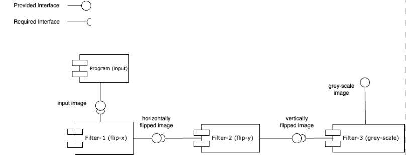
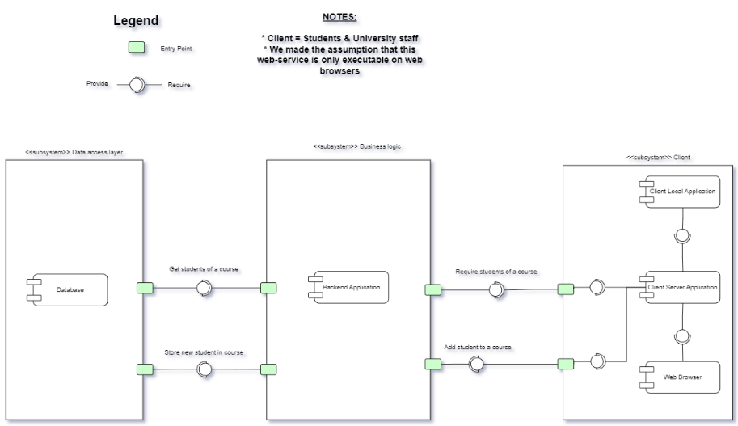
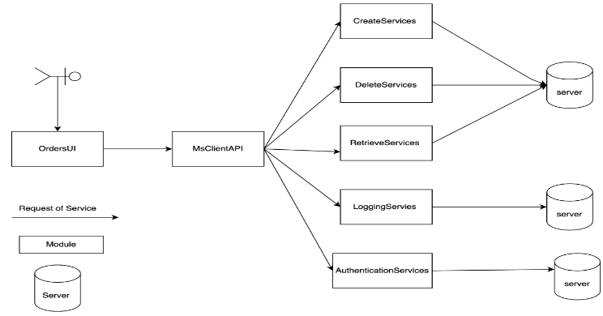

# Fundamentals of Software Architecture

> Developed by [Mohamad Khalil](https://github.com/Chef03), [Joel Mattsson](https://github.com/mrjex), and Jackson Niyomugabo during August - October 2023

## Table of Contents

- [Fundamentals of Software Architecture](#fundamentals-of-software-architecture)
  - [Table of Contents](#table-of-contents)
  - [Overview](#overview)
  - [System Descriptions](#system-descriptions)
  - [Architectures](#architectures)
    - [Pipe And Filter](#pipe-and-filter)
    - [Web Services](#web-services)
    - [Microservices](#microservices)
  - [Demos](#demos)

## Overview

This project explores three distinct software architectural styles through practical implementation. We learned about architecture with respect to pros and cons coupled with quality attributes such as **Performance**, **Availability**, and **Reliability** and studied different architectural approaches.

## System Descriptions

[Module 1](pipe-and-filter/README.md) is an image manipulation program written in C++ that utilizes a variety of filters to modify provided images. This module demonstrates the **Pipe-And-Filter** architectural style. Note that extensive knowledge of C++ is not expected to complete the exercises.

[Module 2](web-services/README.md) is Brimula, a staff management web platform designed specifically for examiners and lecturers, with front-end and back-end modules. This module implements the **Web-Services** architectural style.

[Module 3](microservices/README.md) is an application storing customer data as a collection of orders, written in Java. It consists of a command-line based user interface and MySQL database back-end. This module is designed around the **Microservices architectural style**, utilizing Java's Remote Method Invocation (RMI).

## Architectures

### Pipe And Filter

The Pipe and Filter architecture processes data through a sequence of independent components (filters) connected by pipes. Each filter performs a specific transformation on the input data and passes the result to the next filter.

### Web Services

The Web Services architecture uses HTTP-based communication protocols to enable client-server interaction. The frontend and backend are separated, with REST APIs facilitating data exchange between components.

### Microservices

The Microservices architecture decomposes the application into small, independently deployable services. Each service focuses on a specific business function and communicates with others through lightweight protocols.

## Demos

**Pipe And Filter (C++):** 

**Web Services (Javascript):** 

**Microservices (Java):** 